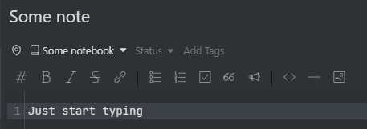

# Navigation Helper

This plugin simplifies the navigation in Inkdrop.

## Features

### Navigation history
Navigate back and forth in the navigation history in the ui.

### Bring to notebook
Navigate to the notebook of the current note.

## Contact

If you have any suggestions for this plugin, feel free to share them with me by opening an [issue on Github](https://github.com/keisir/inkdrop-navigation-helper/issues).

If you find a bug, you can also submit it to me by opening an [issue on Github](https://github.com/keisir/inkdrop-navigation-helper/issues).

## Changelog

## 1.1.2 - Support Inkdrop `>= 5.8.0`
- In Inkdrop v5.8.0 navigation with mouse buttons is natively supported. Therefore, the plugin now only provides the visual component for navigation.
- It is planned to add additional features in the future. (some opinioated navigation features that i have in mind)

### 1.1.1 - Support Inkdrop `>= 5.6.3`
- Fixed a bug that affected the layout when the plugin was used with Inkdrop `>= 5.6.3`.

### 1.1.0 - UX
- Arrow keys are now slightly larger
- The arrow keys are now disabled when navigation in that direction is not possible.

### 1.0.0 - Initial release
- Added basic UI component for navigation
- Added mapping between mouse buttons and navigation commands
